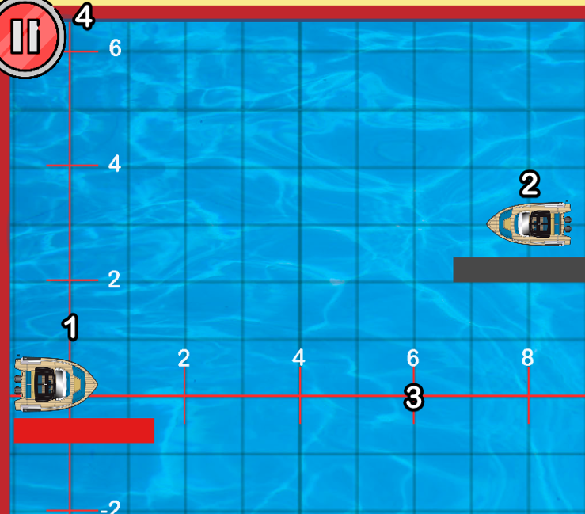
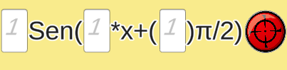
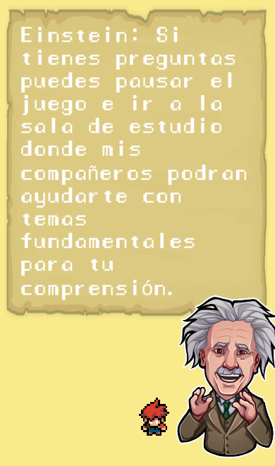

<!--
repo name: BEST-README
description: An awesome README template to jumpstart your projects!
github name:  oGranny
link: LINK
logo path: assets/logo.png
screenshot: assets/ss.png
twitter: your_username
email: example@email.com
-->

<!-- PROJECT LOGO -->
 

    
    

         
         
         
        * <a href="https://github.com/Pab10Suarez/Mathwars/releases">Descargar prototipo</a>
        *
        <a href="https://github.com/Pab10Suarez/Mathwars/issues/new">Reportar un bug</a>
    

<!-- TABLE OF CONTENTS -->
## Tabla de contenidos

* [Acerca del proyecto](#acerca-del-proyecto)   
* [Instalación](#instalación)
* [Contenido del juego](#contenido-del-juego)
  * [Como jugar](#como-jugar)
  * [Donde estudiar](#donde-estudiar)
  * [Iniciar sesión](#iniciar-sesión)
* [Documentacion](#documentacion)

<!-- ABOUT THE PROJECT -->
## Acerca del proyecto
Mathwars es un videojuego diseñado para que los usuarios puedan aprender matematicas de una forma entretenida. Creado como proyecto para la materia Programacion orientada a objetos de la 
Universidad Nacional de Colombia

<!-- GETTING STARTED -->
## Instalación
* Para poder jugar solo tienes que dirigirte a la seccion de lanzamientos y escoger la versión de tu sistema haciendo <a href="https://github.com/Pab10Suarez/Mathwars/releases">click aquí</a>
* Después de descomprimir los archivos del juego tienes que abrir el ejecutable <b>Mathwars.exe</b> 
</img> 

## Contenido del juego 
 * ## Como jugar 
   * ### Plano 
      
      1 <b>Jugador</b>  
        Es el barco el cual vamos a manejar y el cual tenemos que cuidar ya que cuenta con una barra que muestra la municion que tenemos actualmente si se nos acaba perdemos el juego. 
        2 <b>Enemigo</b>  
            Tenemos que atacar a los barcos enemigos con ayuda de las funciones disponibles, para esto debemos modificar los valores de las funciones y asi poder acertar.(Esto se explica mas a  detalle en la seccion [Zona de ataque](#zona-de-ataque))  
        3 <b>Plano de ataque</b>   Son nuestras coordenadas de referencia para poder calcular que ajustes debemos hacer en la función para logarar un disparo exitoso. 
        4 <b>Menú de pausa</b> 
            Despliega un menú donde se puede ajustar el volumen y volver al menú principal.    
   * ### Zona de ataque 
       
    Acá es donde podemos modificar la funcion a nuestro gusto solo haciendo click y escribiendo el valor deseado y luego presionando el boton rojo de disparo. Si tienes dudas sobre que hace cada campo, puedes dirigirte a la seccion estudiar, desde el menú principal.
   * ### Ayudante 
       
    En esta sección podemos pedirle consejos al ayudante solo tenemos que acercarnos hacia él con las flechas del teclado y nos mostrará un dialogo.
 * ## Donde estudiar
    Desde el menú principal se puede dirigir a la sección de estudios donde está una explicacion de lo que hace cada funcion y como modificarla, solo hay que acercarse al ayudante y dar click para recibir la explicación de él.
  * ## Iniciar sesión
    Desde el menú principal se puede inciciar sesión, sin embargo si no se tiene una cuenta en ese mismo lugar hay espacio para registrarse.      
## Documentacion
<a href="https://github.com/Pab10Suarez/Mathwars/files/10145907/Manual_Poo.1.pdf"><strong>Manualtécnico.pdf</strong></a> 
<a href="https://github.com/Pab10Suarez/Mathwars/files/10145884/PresentacionUNALazul-POO-Mathwars.pptx"><strong>Presentación</strong></a> 
<a href="https://github.com/Pab10Suarez/Mathwars/wiki/Diagramas"><strong>Diagramas</strong></a> 
<a href="https://githup-integration.atlassian.net/jira/software/projects/MW/boards/1/roadmap"><strong>Jira</strong></a>
